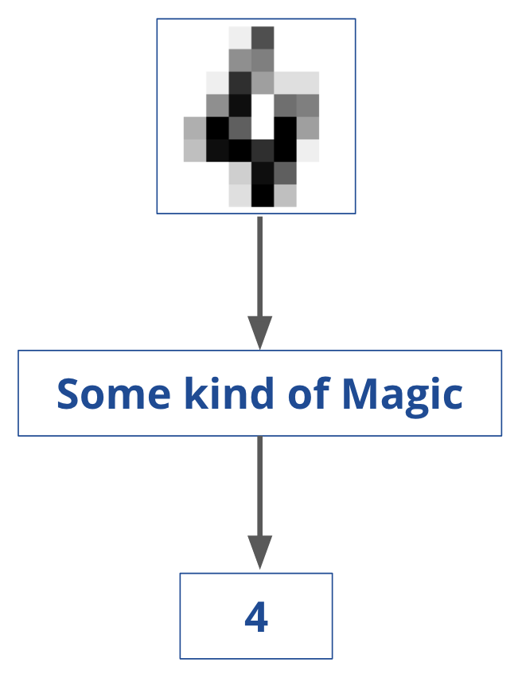
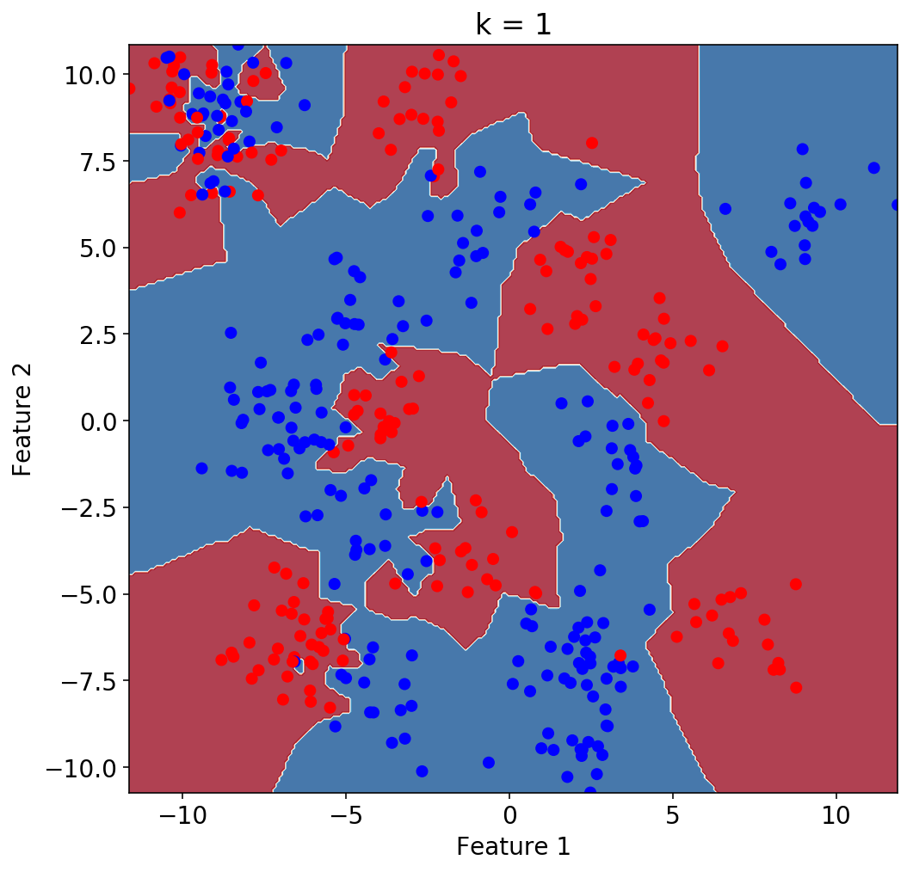
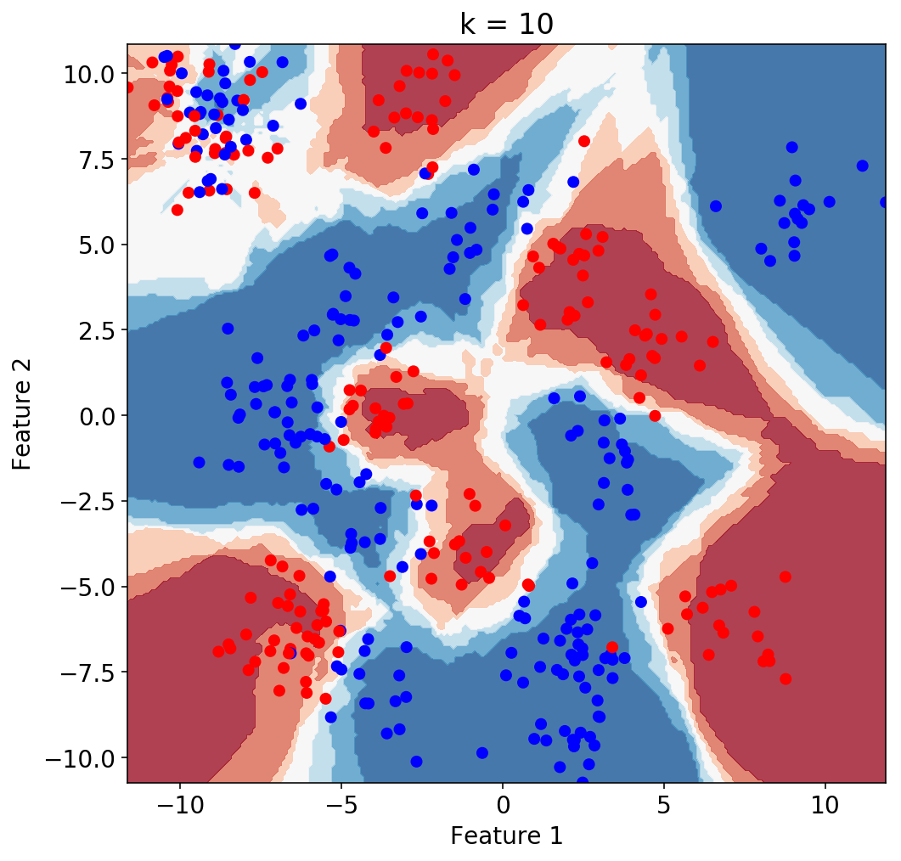
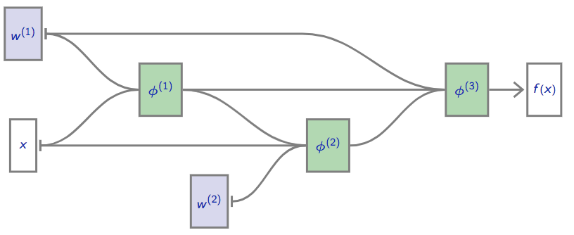

class: middle, center, title-slide

# Deep Natural Language Processing


.footnote[Tim Head, Wild Tree Tech, ETH Zurich, June 2018]

---

# Hello, I am Tim

Physics student at University of Manchester, PhD at Manchester with time
at Fermilab, then research fellow at CERN, then EPFL.

Got interested in machine-learning because I thought it would be an easy way
to get some impressive results ...

---

# Wild Tree Tech

.center.width-20[]

Tim is a doctor of experimental physics, worked at CERN and EPFL,
contributor to the PyData ecosystem.

Wild Tree Tech builds bespoke solutions for clients all around the world,
from startups to UN organisations.

* digital products that leverage machine-learning and AI,
* teaching machine-learning courses, and
* small and large JupyterHub deployments.

Visit [http://www.wildtreetech.com](www.wildtreetech.com).

---

# Goals

* You will know how to construct a simple neural network with one hidden
  layer to do multi-class classification from scratch.
* You will leave knowing how to use spacy and gensim for NLP tasks
  in a production setting.
* You will know what reucrrent neural networks are and how to apply them to
  short sequences of text.
* You will learn what word embeddings are and how to use them to build powerful
  models for text classification.
* You will know how a seq2seq model works and able to train one to
  translate short documents.
* You will have ideas on computing document similarity.
--

* Leave with a framework of all this that makes sense to you, and let's you
  add new knowledge to it!

---

# Structure

As structured as neccessary, as unstructured as we can get away with.

Each day will have sessions of 60 or 90minutes, starting with an introduction,
then time to code&discuss, and end with an outro.

Most examples are in the form of Jupyter notebooks, will distribute my
answer to the gaps at the end of each day. Tried to make them so you will
not run out of things to do.

Approximate schedule: work, coffee, work, lunch, work, work, coffee, work.

---

# Philosophy

.center[]

* You have to start small.
* You can only learn by doing.
* Try to predict what will happen, then try them out and compare.

---

class: middle, center

# Today: Building a solid foundation

---

# Day 1

* 9.00 - 9.30 arrival, introductions, plan for the day(s)
* 9.30 - 10.30 spacy 101. Introduce the jargon of NLP
* 10.40 - 12.10 linear regression, loss, gradient descent
* lunch
* 13.10 - 14.40 logistic regression
* 14.40 - 15.40 under- and over-fitting, measuring performance
* coffee
* 16.00 - 17.30 A simple NN in keras

---

# Spacy

Industrial strength NLP.

---

# Spacy - outro

* Fast, reliable, modern.
* Tokeniser, parser, part-of-speech, named entity recogniser.
* Concolutional neural networks under the hood.
* Supports 20+ languages.
* Use it from Python, most heavy lifting is in Cython.
* MIT license
* Code: https://github.com/explosion/spaCy
* Documentation: https://spacy.io/usage/
* In-depth code examples: https://spacy.io/usage/examples

---

# Neural networks = Magic?

.width-50.center[]

---

# Typical picture of a Neural Net

.center.width-100[]

---

# Neural networks in one slide

A (very) complicated mathematical function. That is it.

Takes in a collection of numbers (pixel intensities) and outputs numbers (class probabilities).

.larger.center[
f() $= [x_0, x_1, x_2, ..., x_7, x_8, x_9]$
]

Neural networks can have several layers.
* final layer performs logistic regression
* all previous layers transform the data from one representation to another.

---

# More Sunshine, More Hot

.width-60.center[]

Linear regression problem: $ y = Wx +b $

Use mean squared error to judge how good predictions are and adjust $W$ and $b$
to improve prediction.

---

# Optimise parameters

We need to find the best values of the parameters $W$ and $b$.

What is best? - need a quantative way to define best.

--

Loss functions: measure how good our solution is.

--

Better parameters have lower loss. Use that to improve our parameters!

Jargon: stochastic gradient descent optimiser.

---

# Coding

Two notebooks:
1. introduce Python, plotting, compute loss and implement simple optimiser
2. use results from 1. to build a class that implements linear regression

Outro at 11.55h, after that lunch.

---

# Linear regression outro

* loss functions measure how well we are doing, lower is better
* use gradient of loss function to update parameters of the model
* need to compute analytic gradients
* gradient descent: $w \leftarrow w + \alpha \frac{\partial L}{\partial w}$
* learning rate $\alpha$ is a hyper-parameter we need to tune by hand
* stochastic gradient descent uses only a few samples to compute gradient at
  each step

---

# Lunch break

See you back here at 1.10pm or 13.10h.

---

# More Sunshine, More Hot

.width-60.center[]

Linear regression problem: $ y = Wx +b $

Use mean squared error to judge how good predictions are and adjust $W$ and $b$
to improve prediction.

---

# Is it too hot?

.width-60.center[]

Predict binary outcome (zero or one) from input variable(s).

Use a linear classifier.

---

# Is it too hot?

.width-40.center[]

$$\mathbf{y} = \mathbf{W}x + \mathbf{b}$$

$\mathbf{y}$ and $\mathbf{b}$ are now vectors, $\mathbf{W}$ is a matrix, and
$\mathbf{y}$ contains the score for each class.

What we’d really like is class probabilities.

---

# Is it too hot?

.width-40.center[]

$$\binom{y_0}{y_1} = \binom{W_0}{W_1} (x) + \binom{b_0}{b_1}$$

$\mathbf{y}$ and $\mathbf{b}$ are now vectors, $\mathbf{W}$ is a matrix (if we had more than one feature), and
$\mathbf{y}$ contains the score for each class.

What we’d really like is class probabilities.

---

# The Softmax

$$
softmax(\mathbf{x}) = \frac{1}{\sum_{i=1}^{n}{e^{x_i}}}
\cdot
\begin{bmatrix}
  e^{x_1}\\\\
  e^{x_2}\\\\
  \vdots\\\\
  e^{x_n}
\end{bmatrix}
$$

Normalise elements of $\mathbf{x}$ so that they sum to 1. We can interpret
the new vector as a set of probabilities.

.width-40.center[]

Compact notation for linear classifier (or logistic regression):
$$ \mathbf{y} = \mathsf{softmax} \( \mathbf{W} x + \mathbf{b} \) $$

$y$ now contains the normalised probabilities for each class.

---

# Logistic Regression

We have:
* function $f(x; W, b)$ that we can use to make predictions $\hat{y}$
    - $f(x; W, b) = \mathsf{softmax}(\mathbf{W} x + \mathbf{b})$
* a loss function to measure how well our model is doing $L(\hat{y}, y)$
    - log-loss or cross-entropy: $y\log p + (1-y) \log(1-p)$
* find optimal values of $\mathbf{W}$ and $\mathbf{b}$ by gradient descent
    - compute gradient of $L$ w.r.t. each parameter $\frac{dL}{dW}$ and $\frac{dL}{db}$
    - update parameters $W \leftarrow W + \alpha \frac{dL}{dW}$ and $b \leftarrow b + \alpha \frac{dL}{db}$

---

# Typical picture of a Neural Net

.center.width-80[]

$$h_1 = \tanh(\mathbf{W_1} x + \mathbf{b_1})$$
$$h_2 = \tanh(\mathbf{W_2} h_1 + \mathbf{b_2})$$
$$y = \mathsf{softmax}(\mathbf{W_o} h_2 + \mathbf{b_o})$$

Final layer is just logistic regression.

---

# Logistic regression

Next notebook extends the linear regression example to implement logistic
regression. From there it is only a small step to a real neural network.

Computing the gradients is a bit more tricky here. If you are good at
linear algebra attempt it, but keep an eye on the time.

---

# Logistic regression - outro

* Mostly things are as they were for linear regression but a bit more
  "vectorised".
* This game essentially continues the more and more you add fully-connected
  layers.

---

# Over- and under-fitting

measuring performance
* https://developers.google.com/machine-learning/crash-course/generalization/peril-of-overfitting
* 15m generalisation
* 25m training and test
* 40m validation
* https://www.scipy-lectures.org/packages/scikit-learn/index.html#parameter-selection-validation-and-testing
* http://scikit-learn.org/stable/auto_examples/model_selection/plot_underfitting_overfitting.html#sphx-glr-auto-examples-model-selection-plot-underfitting-overfitting-py

---

# $k$ Nearest Neighbours

.center.width-70[]

<div style="margin-top: -20px">
$$f(x) = y_i, i = \mathrm{argmin}_j || x_j - x ||$$
</div>

---

# $k$ Nearest Neighbours ($k=1$)

.center.width-70[]

---

# Accuracy ($k=1$)

What is the accuracy of this classifier?

---

# Generalisation error

We are interested in how well the classifier performs on data from the future.

Split off a fraction of the dataset at the start, use it to simulate the future.

Training data:

| $i$ | Feature 1 | Feature 2 |
| --- | ----------- | -------- |
| 0   | 2.14         | 5.234     |
| 1   | 1.124        | 0.32      |
| 2   | -2.24       | 2.32      |
| 3   | -1.24        | 3.23      |

Testing data:

| $i$ | Feature 1 | Feature 2 |
| --- | ----------- | -------- |
| 4   | 5.34        | 6.34    |
| 5   | 2.24          | -5.23      |

---

# Accuracy ($k=1$)

What is the accuracy of this classifier?

| $k$ | Train | Test |
| --- | ----- | ---- |
| 1 | 1.0 | 0.85 |

---

# $k$ Nearest Neighbours ($k=10$)

.center.width-70[]

---

# $k$ Nearest Neighbours ($k=10$)

.center.width-70[]

---

# What happens if you change $k$?

.gallery[





]

---

# What happens if you change $k$?

.center.width-70[]

---

# Under- and Overfitting

.center.width-90[]

---

# Under- and Overfitting

.center.width-90[]

---

# Under- and Overfitting

.center.width-90[]

---

class: middle,center
# Coffee ☕️☕️

---

# Neural networks in production

.width-90.center[]

A high-level interface to Tensorflow. Wide spread use amongst researchers.

---


# Simple Neuron

$$ f(x) = \sigma(w \cdot x + b) $$

--

.width-50.center[]

$\sigma$ is our activation function/nonlinearity.

.footnote[From https://documents.epfl.ch/users/f/fl/fleuret/www/dlc/]
---

# Simple Neuron

$$ f(x) = \sigma(w \cdot x + b) $$

.width-50.center[]

Using "tensor" notation.

.footnote[From https://documents.epfl.ch/users/f/fl/fleuret/www/dlc/]

---

# Simple Neural Network

.width-100.center[]

$$ f(x) = \sigma(w_2 \cdot \sigma(w_1 \cdot x + b_1) + b_2) $$

.footnote[From https://documents.epfl.ch/users/f/fl/fleuret/www/dlc/]

---

# In General: A Directed Acyclical Graph

.width-80.center[]

.footnote[From https://documents.epfl.ch/users/f/fl/fleuret/www/dlc/]

---

# Tomorrow: recurrent neural networks

.width-80.center[]

.footnote[From https://documents.epfl.ch/users/f/fl/fleuret/www/dlc/]

---

# Recap of the day

* Learnt fundamentals of machine-learning.
* How to measure the performance of our pipeline.
* Constructed building blocks of neural networks from scratch.
* Implemented small neural network using keras.
* The secret sauce of neural networks is that they are feature transformers!

---

class: middle, center

# Today: Words, words, words

---

# Day 2

* 9.00 - 9.30 Plan for the day
* 9.30 - 10.30 TfIdf as basic word vectors
* 10.40 - 12.10 word2vec and doc2vec
* lunch
* 13.10 - 14.40 Linear models + pretrained embeddings
* 14.40 - 15.40 Dealing with sequences: LSTM, GRU and Conv1D
* coffee
* 16.00 - 17.30 ETH ticket database

---

# Neural networks are just maths

.center.width-80[]

$$h_1 = \tanh(\mathbf{W_1} x + \mathbf{b_1})$$
$$h_2 = \tanh(\mathbf{W_2} h_1 + \mathbf{b_2})$$
$$y = \mathsf{softmax}(\mathbf{W_o} h_2 + \mathbf{b_o})$$

Final layer is just logistic regression.

---

# Simple Neural Network

.width-100.center[]

$$ f(x) = \sigma(w_2 \cdot \sigma(w_1 \cdot x + b_1) + b_2) $$

.footnote[From https://documents.epfl.ch/users/f/fl/fleuret/www/dlc/]

---

# In General: A Directed Acyclical Graph

.width-80.center[]

.footnote[From https://documents.epfl.ch/users/f/fl/fleuret/www/dlc/]

---

# Finding the sweetspot

.center.width-90[]

---

# Representing words for machine-learning

.width-100.center[]

---

# Toy example

```python
malory = ["Do you want ants?",
          "Because that’s how you get ants."]
```
```python
from sklearn.feature_extraction.text import CountVectorizer
vect = CountVectorizer()
vect.fit(malory)
print(vect.get_feature_names())
# ['ants', 'because', 'do', 'get', 'how', 'that', 'want', 'you']
```

```python
X = vect.transform(malory)
print(X.toarray())
# array([[1, 0, 1, 0, 0, 0, 1, 1],
#        [1, 1, 0, 1, 1, 1, 0, 1]])
```

---

# It is a "bag" of words

```python
print(malory)
print(vect.inverse_transform(X)[0])
print(vect.inverse_transform(X)[1])
```

Output:
```
['Do you want ants?', 'Because that’s how you get ants.']
['ants' 'do' 'want' 'you']
['ants' 'because' 'get' 'how' 'that' 'you']
```

---

# Movie reviews

We will use a dataset containing about 25000 movie reviews and associated
rating for those movies. Build a model that can predict from the text of
the review if people will like it or not.

Binary classification task.

Explore "vectorisation" and create a baseline model to compare to.

---

# TfIdf outro

* techniques seen so far are simple, old-school, robust.
* implementing old-school algorithms is simple with scikit-learn.
* keep yourself honest by creating a (strong) baseline.
* Logistic regression on "word vectors" is hard to beat.
