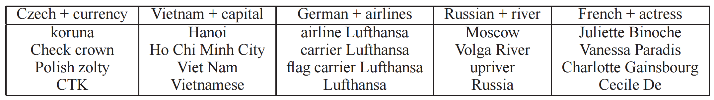
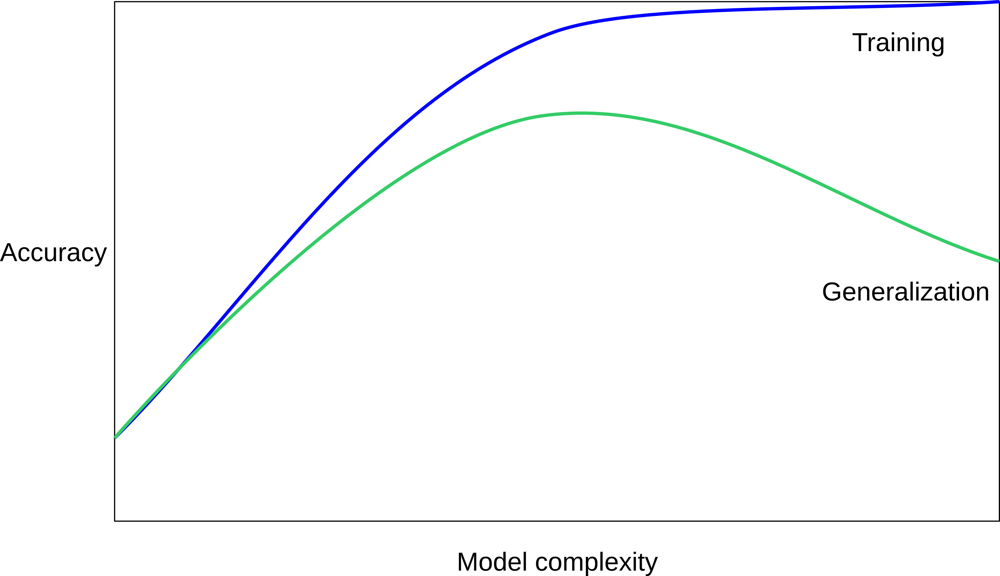

class: middle, center, title-slide

# Deep Natural Language Processing


.footnote[Tim Head, Wild Tree Tech, ETH Zurich, June 2018]

---

# Hello, I am Tim

Physics student at University of Manchester, PhD at Manchester with time
at Fermilab, then research fellow at CERN, then EPFL.

Got interested in machine-learning because I thought it would be an easy way
to get some impressive results ...

Who are you and how did you get interested?

---

# Wild Tree Tech

.center.width-20[]

Tim is a doctor of experimental physics, worked at CERN and EPFL,
contributor to the PyData ecosystem.

Wild Tree Tech builds bespoke solutions for clients all around the world,
from startups to UN organisations.

* digital products that leverage machine-learning and AI,
* teaching machine-learning courses, and
* small and large JupyterHub deployments.

Visit [http://www.wildtreetech.com](www.wildtreetech.com).

---
class: middle, center

# A Whirlwind Tour

---

# Natural Language Processing

.center[

]

---
# Natural Language Processing is used for:

- Sentence/Document level Classification (topic, sentiment, language, ...)
- Topic modeling (LDA, ...)
- Translation
- Chatbots / dialogue systems / assistants (Alexa, ...)
- Summarisation

---

# How to represent text for machines?

Words are indexed and represented as 1-hot vectors.

Large Vocabulary of possible words $|V|$.

Then convert to `Embeddings` as inputs in all Deep NLP tasks.

Word embeddings usually have dimensions 50, 100, 200, 300.

---

# Supervised Text Classification

.center[

]

.footnote.small[
Joulin, Armand, et al. "Bag of tricks for efficient text classification." FAIR 2016
]

--

$\mathbf{E}$ embedding (linear projection), shape: .red[`|V| x H`]

--

Embeddings are averaged, hidden activation siz: .red[`H`]

--

Dense output connection $\mathbf{W}, \mathbf{b}$, shape: .red[`H x K`]

--

Softmax and cross-entropy loss over $K$ classes.

---

# Supervised Text Classification

.center[

]

.footnote.small[
Joulin, Armand, et al. "Bag of tricks for efficient text classification." FAIR 2016
]

<br/>

- Very efficient (**speed** and **accuracy**) on large datasets
- State-of-the-art (or close to) on several classification tasks, when adding **bigrams/trigrams**
- Don't gain much from depth

---

# Transfer learning wins!

Ask the same question as for images: can we have word representations (embeddings) that
are generic enough to transfer from one task to another?

Want to take advantage of the nearly infinite supply of text on the internet.

The answer is: yes!

---

# Word2Vec

Similar vectors:
.center[

]

Can perform arithmetic on these vectors:
.center[

]

.footnote.small[
Colobert et al. 2011, Mikolov, et al. 2013
]

---

# Neural networks

Linear algebra arranged as a DAG.

.width-100.center[]

$$ f(x) = \sigma(w_2 \cdot \sigma(w_1 \cdot x + b_1) + b_2) $$

A neural network for classification with one fully connected hidden layer.

.footnote[From https://documents.epfl.ch/users/f/fl/fleuret/www/dlc/]

---

# In General: A Directed Acyclical Graph

.width-80.center[]

Lots of freedom for how you connect all the building blocks/operations.

.footnote[From https://documents.epfl.ch/users/f/fl/fleuret/www/dlc/]

---

# Language Models

Assign a probability to a sequence of words, such that plausible sequences have
higher probabilities. For example:

- $p(\text{"I like dogs"}) > p(\text{"I swim dogs"})$
- $p(\text{"I like dogs"}) > p(\text{"like I dogs"})$

Auto-regressive sequence modelling:

$p\_{\theta}(w\_{0})$

$p_{\theta}$ is parametrized by a neural network.

---

# Language Models

Assign a probability to a sequence of words, such that plausible sequences have
higher probabilities e.g:

- $p(\text{"I like dogs"}) > p(\text{"I swim dogs"})$
- $p(\text{"I like dogs"}) > p(\text{"like I dogs"})$

Auto-regressive sequence modelling

$p\_{\theta}(w\_{0}) \cdot p\_{\theta}(w\_{1} | w\_{0})$

$p_{\theta}$ is parametrized by a neural network.

---

# Language Models

Assign a probability to a sequence of words, such that plausible sequences have
higher probabilities e.g:

- $p(\text{"I like dogs"}) > p(\text{"I swim dogs"})$
- $p(\text{"I like dogs"}) > p(\text{"like I dogs"})$

Auto-regressive sequence modelling

$p\_{\theta}(w\_{0}) \cdot p\_{\theta}(w\_{1} | w\_{0}) \cdot \ldots \cdot p\_{\theta}(w\_n | w\_{n-1}, w\_{n-2}, \ldots, w\_0)$

$p_{\theta}$ is parametrized by a neural network.

The motivation is that an internal representation of the model is better at
capturing the meaning of a sequence than a simple Bag-of-Words (unordered set).
---

# Conditional Language Models

Translation can be expressed as Conditional Language Model:

- $p(Target | Source)$
- *Source*: "Ich finde Katzen toll."
- *Target*: "I like cats."

Model the output word by word:

$p\_{\theta}(w\_{0} | Source) \cdot p\_{\theta}(w\_{1} | w\_{0}, Source) \cdot \ldots $

How do we get a good representation of the data?

---

# Simple language model

.center[

]

Use a fixed context size. What to do about combining information from
each word:

- Average embeddings: (same as Continous BoW) no sequence information
- Concatenate embeddings: introduces many parameters
- 1D convolution: larger contexts and limit number of parameters
- Still does not take into account varying sequence sizes and sequence dependencies

---

# Recurrent Neural Network

.center[

]

--

Unroll over a sequence $(x_0, x_1, x_2)$:

.center[

]

???

Accumulate knowledge from a sequence into a fixed size representation.

---

# RNN Language Modelling

.center[

]

Train with:

* input $(w\_0, w\_1, ..., w\_t)$ .small[ sequence of (encoded) words]
* output $(w\_1, w\_2, ..., w\_{t+1})$ .small[shifted sequence of (encoded) words]

---

# Neural networks are feature transformers

Keep transforming your data until it is linearly separable.

[Solve circle-in-circle problem](http://playground.tensorflow.org/#activation=tanh&batchSize=10&dataset=circle&regDataset=reg-plane&learningRate=0.03&regularizationRate=0&noise=10&networkShape=3&seed=0.44312&showTestData=false&discretize=false&percTrainData=50&x=true&y=true&xTimesY=false&xSquared=false&ySquared=false&cosX=false&sinX=false&cosY=false&sinY=false&collectStats=false&problem=classification&initZero=false&hideText=false)

.width-100.center[]

---

# Goals

* You will know how to construct a simple neural network with one hidden
  layer to do multi-class classification from scratch.
* You will leave knowing how to use spacy and gensim for NLP tasks
  in a production setting.
* You will know what recurrent neural networks are and how to apply them to
  short sequences of text.
* You will learn what word embeddings are and how to use them to build powerful
  models for text classification.
* You will know how a seq2seq model works and will be able to train one to
  translate short documents.
* You will have ideas on computing document similarity.
--

* Leave with a framework of all this that makes sense to you, and let's you
  add new knowledge to it!

---

# Structure

As structured as neccessary, as unstructured as we can get away with.

Each day will have sessions of 60 or 90minutes, starting with an introduction,
then time to code&discuss, and end with an outro.

Most examples are in the form of Jupyter notebooks, will distribute my
answer to the gaps at the end of each day. Tried to make them so you will
not run out of things to do.

Approximate schedule: work, coffee, work, lunch, work, work, coffee, work.

---

# Philosophy

.center[]

* You have to start small.
* You can only learn by doing.
* Limited by your thinking, not typing speed.
* Try to predict what will happen, then try them out and compare.

---

class: middle, center

# Today: Building a solid foundation

---

# Day 1

* 9.00 - 10.00 arrival, introductions, plan for the day(s)
* 10.00 - 10.30 spacy 101. Introduce the jargon of NLP
* coffee ☕️
* 10.40 - 12.10 linear regression, loss, gradient descent
* lunch
* 13.10 - 14.40 logistic regression
* 14.40 - 15.40 under- and over-fitting, measuring performance
* coffee ☕️
* 16.00 - 17.00 A simple NN in keras

---

# Spacy

Industrial strength NLP.

---

# Spacy - outro

* Fast, reliable, modern.
* Tokeniser, parser, part-of-speech, named entity recogniser.
* Concolutional neural networks under the hood.
* Supports 20+ languages.
* Use it from Python, most heavy lifting is in Cython.
* MIT license
* Code: https://github.com/explosion/spaCy
* Documentation: https://spacy.io/usage/
* In-depth code examples: https://spacy.io/usage/examples

---

# Neural networks = Magic?

.width-50.center[]

---

# Typical picture of a Neural Net

.center.width-100[]

---

# Neural networks in one slide

A (very) complicated mathematical function. That is it.

Takes in a collection of numbers (pixel intensities) and outputs numbers (class probabilities).

.larger.center[
f() $= [x_0, x_1, x_2, ..., x_7, x_8, x_9]$
]

Neural networks can have several layers.
* final layer performs logistic regression
* all previous layers transform the data from one representation to another.

---

# More Sunshine, More Hot

.width-60.center[]

Linear regression problem: $ y = Wx +b $

Use mean squared error to judge how good predictions are and adjust $W$ and $b$
to improve prediction.

---

# Optimise parameters

We need to find the best values of the parameters $W$ and $b$.

What is best? - need a quantative way to define best.

--

Loss functions: measure how good our solution is.

--

Better parameters have lower loss. Use that to improve our parameters!

Jargon: stochastic gradient descent optimiser.

---

# Coding

Two notebooks:
1. introduce Python, plotting, compute loss and implement simple optimiser
2. use results from 1. to build a class that implements linear regression

Outro at 11.55h, after that lunch.

---

# Linear regression outro

* loss functions measure how well we are doing, lower is better
* use gradient of loss function to update parameters of the model
* need to compute analytic gradients
* gradient descent: $w \leftarrow w + \alpha \frac{\partial L}{\partial w}$
* learning rate $\alpha$ is a hyper-parameter we need to tune by hand
* stochastic gradient descent uses only a few samples to compute gradient at
  each step

---

# Lunch break

See you back here at 1.10pm or 13.10h.

---

# More Sunshine, More Hot

.width-60.center[]

Linear regression problem: $ y = Wx +b $

Use mean squared error to judge how good predictions are and adjust $W$ and $b$
to improve prediction.

---

# Is it too hot?

.width-60.center[]

Predict binary outcome (zero or one) from input variable(s).

Use a linear classifier.

---

# Is it too hot?

.width-40.center[]

$$\mathbf{y} = \mathbf{W}x + \mathbf{b}$$

$\mathbf{y}$ and $\mathbf{b}$ are now vectors, $\mathbf{W}$ is a matrix, and
$\mathbf{y}$ contains the score for each class.

What we’d really like is class probabilities.

---

# Is it too hot?

.width-40.center[]

$$\binom{y_0}{y_1} = \binom{W_0}{W_1} (x) + \binom{b_0}{b_1}$$

$\mathbf{y}$ and $\mathbf{b}$ are now vectors, $\mathbf{W}$ is a matrix (if we had more than one feature), and
$\mathbf{y}$ contains the score for each class.

What we’d really like is class probabilities.

---

# The Softmax

$$
softmax(\mathbf{x}) = \frac{1}{\sum_{i=1}^{n}{e^{x_i}}}
\cdot
\begin{bmatrix}
  e^{x_1}\\\\
  e^{x_2}\\\\
  \vdots\\\\
  e^{x_n}
\end{bmatrix}
$$

Normalise elements of $\mathbf{x}$ so that they sum to 1. We can interpret
the new vector as a set of probabilities.

.width-40.center[]

Compact notation for linear classifier (or logistic regression):
$$ \mathbf{y} = \mathsf{softmax} \( \mathbf{W} x + \mathbf{b} \) $$

$y$ now contains the normalised probabilities for each class.

---

# Logistic Regression

We have:
* function $f(x; W, b)$ that we can use to make predictions $\hat{y}$
    - $f(x; W, b) = \mathsf{softmax}(\mathbf{W} x + \mathbf{b})$
* a loss function to measure how well our model is doing $L(\hat{y}, y)$
    - log-loss or cross-entropy: $y\log p + (1-y) \log(1-p)$
* find optimal values of $\mathbf{W}$ and $\mathbf{b}$ by gradient descent
    - compute gradient of $L$ w.r.t. each parameter $\frac{dL}{dW}$ and $\frac{dL}{db}$
    - update parameters $W \leftarrow W + \alpha \frac{dL}{dW}$ and $b \leftarrow b + \alpha \frac{dL}{db}$

---

# Typical picture of a Neural Net

.center.width-80[]

$$h_1 = \tanh(\mathbf{W_1} x + \mathbf{b_1})$$
$$h_2 = \tanh(\mathbf{W_2} h_1 + \mathbf{b_2})$$
$$y = \mathsf{softmax}(\mathbf{W_o} h_2 + \mathbf{b_o})$$

Final layer is just logistic regression.

---

# Logistic regression

Next notebook extends the linear regression example to implement logistic
regression. From there it is only a small step to a real neural network.

Computing the gradients is a bit more tricky here. If you are good at
linear algebra attempt it, but keep an eye on the time.

---

# Logistic regression - outro

* Mostly things are as they were for linear regression but a bit more
  "vectorised".
* This game essentially continues the more and more you add fully-connected
  layers.

---

# Measuring your performance

* keep yourself honest
* over- and under-fitting, the sweetspot
*


---

# $k$ Nearest Neighbours

.center.width-70[]

<div style="margin-top: -20px">
$$f(x) = y_i, i = \mathrm{argmin}_j || x_j - x ||$$
</div>

---

# $k$ Nearest Neighbours ($k=1$)

.center.width-70[]

---

# Accuracy ($k=1$)

What is the accuracy of this classifier?

---

# Generalisation error

We are interested in how well the classifier performs on data from the future.

Split off a fraction of the dataset at the start, use it to simulate the future.

Training data:

| $i$ | Feature 1 | Feature 2 |
| --- | ----------- | -------- |
| 0   | 2.14         | 5.234     |
| 1   | 1.124        | 0.32      |
| 2   | -2.24       | 2.32      |
| 3   | -1.24        | 3.23      |

Testing data:

| $i$ | Feature 1 | Feature 2 |
| --- | ----------- | -------- |
| 4   | 5.34        | 6.34    |
| 5   | 2.24          | -5.23      |

---

# Accuracy ($k=1$)

What is the accuracy of this classifier?

| $k$ | Train | Test |
| --- | ----- | ---- |
| 1 | 1.0 | 0.85 |

---

# $k$ Nearest Neighbours ($k=10$)

.center.width-70[]

---

# $k$ Nearest Neighbours ($k=10$)

.center.width-70[]

---

# What happens if you change $k$?

.gallery[


]

---

# What happens if you change $k$?

.center.width-70[]

---

# Under- and Overfitting

.center.width-90[]

---

# Under- and Overfitting

.center.width-90[]

---

# Under- and Overfitting

.center.width-90[]

Only way to find the sweet spot is to try many different combinations of
hyper-parameters. There usually isn't a nice linear mapping from hyper-parameters
to "model complexity".

---

# Notebooks

* `31-underfitting-overfitting-solved.ipynb` illustrates over- and underfitting
  for a simple regression problem
* `32-test-train-validation-solved.ipynb` illustrates why you need to split your
  data into three sets

---

class: middle,center
# Coffee ☕️☕️

---

# Neural networks in production

.width-90.center[]

A high-level interface to Tensorflow. Wide spread use amongst researchers.

---


# Simple Neuron

$$ f(x) = \sigma(w \cdot x + b) $$

--

.width-50.center[]

$\sigma$ is our activation function/nonlinearity.

.footnote[From https://documents.epfl.ch/users/f/fl/fleuret/www/dlc/]
---

# Simple Neuron

$$ f(x) = \sigma(w \cdot x + b) $$

.width-50.center[]

Using "tensor" notation.

.footnote[From https://documents.epfl.ch/users/f/fl/fleuret/www/dlc/]

---

# Simple Neural Network

.width-100.center[]

$$ f(x) = \sigma(w_2 \cdot \sigma(w_1 \cdot x + b_1) + b_2) $$

.footnote[From https://documents.epfl.ch/users/f/fl/fleuret/www/dlc/]

---

# In General: A Directed Acyclical Graph

.width-80.center[]

.footnote[From https://documents.epfl.ch/users/f/fl/fleuret/www/dlc/]

---

# Notebooks

* `40-keras-fashion-solved.ipynb` build a small neural network to
  classify images of fashion items
* (`39-numpy-multi-layer-network-solved.ipynb` implements a one hidden
    layer neural network using just numpy. Maybe come back to this
    at some later point.)
---

# Tomorrow: recurrent neural networks

.width-80.center[]

.footnote[From https://documents.epfl.ch/users/f/fl/fleuret/www/dlc/]

---

# Recap of the day

* Learnt fundamentals of machine-learning.
* How to measure the performance of our pipeline.
* Constructed building blocks of neural networks from scratch.
* Implemented small neural network using keras.
* The secret sauce of neural networks is that they are feature transformers!

---

class: middle, center

# Today: Words, words, words

Day 2

---

# Day 2

* 9.00 - 9.30 Plan for the day
* 9.30 - 10.30 TfIdf as basic word vectors
* 10.40 - 12.10 word2vec in depth
* lunch
* 13.10 - 14.40 Linear models + pretrained embeddings
* 14.40 - 15.40 Dealing with sequences: LSTM, GRU and Conv1D
* coffee
* 16.00 - 17.30 ETH ticket database

---

# Neural networks are just maths

.center.width-80[]

$$h_1 = \tanh(\mathbf{W_1} x + \mathbf{b_1})$$
$$h_2 = \tanh(\mathbf{W_2} h_1 + \mathbf{b_2})$$
$$y = \mathsf{softmax}(\mathbf{W_o} h_2 + \mathbf{b_o})$$

Final layer is just logistic regression.

---

# Simple Neural Network

.width-100.center[]

$$ f(x) = \sigma(w_2 \cdot \sigma(w_1 \cdot x + b_1) + b_2) $$

.footnote[From https://documents.epfl.ch/users/f/fl/fleuret/www/dlc/]

---

# In General: A Directed Acyclical Graph

.width-80.center[]

.footnote[From https://documents.epfl.ch/users/f/fl/fleuret/www/dlc/]

---

# Finding the sweetspot

.center.width-90[]

---

# Representing words for machine-learning

.width-100.center[]

---

# Toy example

```python
malory = ["Do you want ants?",
          "Because that’s how you get ants."]
```
```python
from sklearn.feature_extraction.text import CountVectorizer
vect = CountVectorizer()
vect.fit(malory)
print(vect.get_feature_names())
# ['ants', 'because', 'do', 'get', 'how', 'that', 'want', 'you']
```

```python
X = vect.transform(malory)
print(X.toarray())
# array([[1, 0, 1, 0, 0, 0, 1, 1],
#        [1, 1, 0, 1, 1, 1, 0, 1]])
```

---

# It is a "bag" of words

```python
print(malory)
print(vect.inverse_transform(X)[0])
print(vect.inverse_transform(X)[1])
```

Output:
```
['Do you want ants?', 'Because that’s how you get ants.']
['ants' 'do' 'want' 'you']
['ants' 'because' 'get' 'how' 'that' 'you']
```

---

# Movie reviews

We will use a dataset containing about 25000 movie reviews and associated
rating for those movies. Build a model that can predict from the text of
the review if people will like it or not.

Binary classification task.

Explore "vectorisation" and create a baseline model to compare to.

---

# TfIdf outro

* techniques seen so far are simple, old-school, robust.
* implementing old-school algorithms is simple with scikit-learn.
* keep yourself honest by creating a (strong) baseline.
* Logistic regression on "word vectors" is hard to beat.

---

# Beyond Bags of Words

Limitations of bag of words:
- Semantics of words not captured
  - distance between `movie` and `film` and `dog` is the same
- Synonymous words not represented
- Very distributed representation of documents

--

- Learn to embed words in a "general" vector space.

---

# Word2Vec

Similar vectors:
.center[

]

Can perform arithmetic on these vectors:
.center[

]

.footnote.small[
Colobert et al. 2011, Mikolov, et al. 2013
]

---

# Similar words are close together

.center[

]

---

# The Idea

- Unsupervised extraction of semantics using large
corpus (wikipedia etc)
- Input: one-hot representation of word (as in BoW).
- Use auxiliary task to learn continuous
representation.

---

# Word2Vec: CBoW

CBoW: representing the context as Continuous Bag-of-Word.

Self-supervision from large unlabeled corpus of text: slide a window over an anchor word and its context:

.center[

]

Plus some computational tricks like "negative mining": http://ruder.io/word-embeddings-softmax/index.html

.footnote.small[
Mikolov, Tomas, et al. "Distributed representations of words and phrases and their compositionality." NIPS 2013
]

???

Softmax is too computationally intensive to be practical: the
normalization term involves a sum over the full vocabulary of
cardinality |V| >> 10000 at each gradient step.

Negative Sampling uses k=5 negative words sampled at random instead.
This is not accurate enough to estimate
`p(x_t|x_{t-2}, x_{t-1}, x_{t+1}, x_t{t+2})`
accuractely but it's a good enough approximation to train a
useful word embedding parameters.

---

# Word2Vec: Skip Gram
<br/>

.center[

]

<br/>

- Given the central word, predict occurence of other words in its context.
- Widely used in practice
- Negative Sampling is used as a cheaper alternative to full softmax.

---

# In practice

Many available implementations:
* spacy
* Gensim
* Word2vec
* Tensorflow
* fastText
* startspace
* (mostly) Don't train yourself!

---

# Use pretrained vectors

Input to any deep or shallow learning algorithm based on text should be
appropriate pre-trained vectors. You can get them from places like:

* Glove: https://nlp.stanford.edu/projects/glove/
* FastText: 157 languages! https://fasttext.cc/docs/en/crawl-vectors.html
* word2vec: https://code.google.com/archive/p/word2vec/

---

# Word vectors outro

You can find a fairly low dimensional (compared to BoW) vector space into which
words can be embedded. The structure of the space represents "semantic similarity"
between words.

Input to any deep or shallow learning algorithm based on text should be
appropriate pre-trained vectors.

You rarely need to train these yourself.

(but if you want to train them yourself you can with `gensim`)

---

class: middle,center
# Lunch 🍲😋

---

# Using word vectors

Next we will look at how you can construct good models with little computing
power.

We will train our own embedding vectors, use pre-trained ones, and
see that all this also works in German.

---

# How to deal with sequential nature of text?

We average (or max, or mean, or ...) the individual word vectors.

You can also try concatenating the mean and the max vector and see
if this increases the performance.

---

# Other questions to investigate

Artificially shrink your dataset:
* how does performance change?
* can you see benefits from using pretrained vectors more or less at small sizes?
* what is the minimum dataset you need to get "reasonable" performance?
* what kind of reviews are misclassified?
* if you swap out common words for their synonym what happens to performance?
  - what happens to the BoW baseline model's performance?

---

# Recurrent Neural Networks

Finally, a tool that can deal with sequences!

Sequence classification:
* sentiment analysis,
* activity recognition (GitBit),
* DNA sequence classification

Sequence synthesis:
* text generation,
* music generation

Sequence-to-sequence translation:
* speech recognition,
* text translation,
* part-of-speech tagging

---

# A Recurrent Neural Network

.center[

]

Unroll over a sequence $(x_0, x_1, x_2)$:

.center[

]

Accumulate knowledge from a sequence into a fixed size representation.

---

# A Recurrent Neural Network

A recurrent model $\Phi$ maintains a recurrent state that is updated at each time
step. Given a sequence $x$ and an initial recurrent state $h_0$ the model
computes a sequence of recurrent states:

$$
h\_t = \Phi(x\_t, h\_{t-1}), \mathsf{with\ } t = 1, 2, 3, ...
$$

We can project the recurrent state into a prediction at any time:
$$
y_t = \Psi(h_t)
$$

---

# The same in code

```
timesteps = 50
input_features = 32
output_features = 64

# random inputs
inputs = np.random.random((timesteps, input_features))
# initial state
state_t = np.zeros((output_features, ))

W = np.random.random((output_features, input_features))
U = np.random.random((output_features, input_features))
b = np.random.random((output_features, ))

successive_outputs = []

for input_t in inputs:
    output_t = np.tanh(np.dot(W, input_t) + np.dot(U, state_t) + b)
    successive_outputs.append(output_t)
    state_t = output_t

# 2D tensor of shape (timesteps, output_features)
final_output = np.concatenate(successive_outputs, axis=0)
```

---

# Colah's explanations are great

Will use the pictures from the following article to explain things,
you should find a moment to read the article as it is great.

http://colah.github.io/posts/2015-08-Understanding-LSTMs/

---
